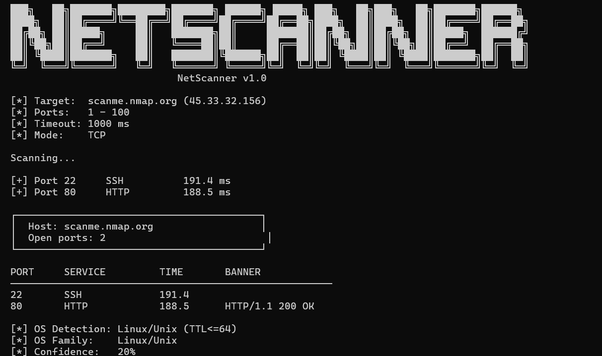
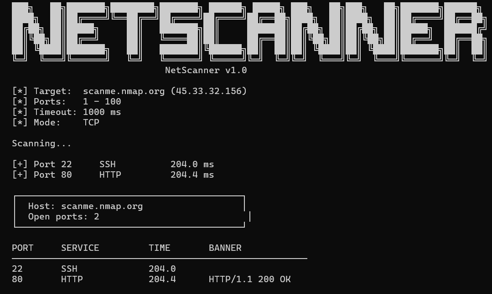
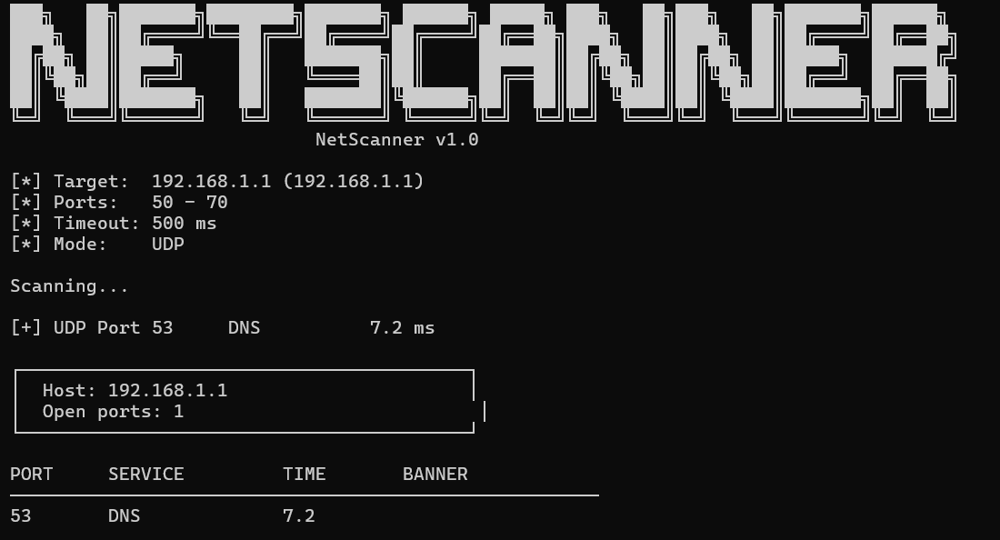

# NetScanner

NetScanner is a lightweight TCP port scanner written in C. It combines fast, multi-threaded scanning with basic service detection and banner grabbing to help you discover open services on target hosts.

Built with POSIX sockets and pthreads, the scanner has no external runtime dependencies beyond a standard C toolchain.

## Demo


[

## What NetScanner Does

- Scans TCP ports in parallel using a thread pool (100 concurrent threads)
- Scans UDP ports with service-specific probes (DNS, SNMP)
- Supports CIDR notation to scan entire subnets (ex: `192.168.1.0/24`)
- Detects common services such as SSH, HTTP, FTP, DNS, and more
- Captures service banners on open ports
- **OS Detection** — fingerprints the target OS using TTL analysis and banner matching
- Saves results to a file with `-o`
- Configurable port range, timeout, and scan mode
- 
## Requirements

- Linux or other POSIX-compatible system
- GCC or another C compiler
- `make`

## Build

To compile the scanner from source, run:

```bash
make
```

This produces the executable `netscanner` in the repository root.

## Usage

```bash
./netscanner -h <host> -p <port-range> -t <timeout-ms>
```

Required options:

- `-h <host>` : target hostname or IP address
- `-p <port-range>` : port range to scan, for example `1-1000` or `80-80`
- `-t <timeout-ms>` : connection timeout in milliseconds

## Command-Line Interface

NetScanner is controlled entirely via the command line. The simple interface is designed for fast scans and easy automation.

### Basic syntax

```bash
./netscanner -h example.com -p 1-1024 -t 1500
```

### What the interface displays

- target host and resolved IP
- scanned port range
- timeout value
- per-port scan result with service detection
- banner text for open services when available

### Tips for using the interface

- Use a narrow port range for quick checks: `-p 20-1024`
- Use a longer timeout for slower networks: `-t 2000`
- Use `80-80`, `22-22`, or `443-443` to scan a single port

## Examples

### Scan a full port range on a public test host

```bash
./netscanner -h scanme.nmap.org -p 1-1000 -t 1000
```

### Scan localhost with a fast timeout

```bash
./netscanner -h 127.0.0.1 -p 1-500 -t 500
```

### Scan a single port for a specific service

```bash
./netscanner -h scanme.nmap.org -p 80-80 -t 2000
```

### Scan a restricted service range

```bash
./netscanner -h 192.168.1.1 -p 20-25 -t 1200
```

### Scan two well-known ports at once

```bash
./netscanner -h example.com -p 22-22 -t 1000
./netscanner -h example.com -p 443-443 -t 1000
```


## Example Output


### TCP Scan — scanme.nmap.org





### UDP Scan — router local  


```text
[*] Target: scanme.nmap.org (45.33.32.156)
[*] Port range: 1 - 1000
[*] Timeout: 1000 ms

Scanning...

[+] Port 22     SSH          194.4 ms
[+] Port 80     HTTP         190.7 ms

PORT   SERVICE   TIME(ms)   BANNER
---------------------------------------------
22     SSH       194.4      SSH-2.0-OpenSSH_8.2p1 Ubuntu-4ubuntu0.6
80     HTTP      191.0      HTTP/1.1 200 OK
```

<<<<<<< HEAD
=======
## Screenshots

These are the real NetScanner screenshots now included in the repository.

### TCP scan interface



This screenshot shows the TCP scan mode with target details, timeout, open ports, and service banners.

### UDP scan interface



This screenshot shows the UDP scan mode with the same clean interface and detected results.
>>>>>>> 8a2fffd (Add real screenshot assets and update README image links)

## How It Works

NetScanner performs TCP connect scans in parallel using POSIX sockets and `select()` for timeouts. For each port in the requested range, the scanner:

1. Creates a non-blocking socket
2. Initiates a TCP connection attempt
3. Waits for the connection result up to the configured timeout
4. Confirms the open port with a lightweight send/receive sequence
5. Reads a service banner when available

The scanner uses a thread pool so many connection attempts can run simultaneously without blocking the entire application.

### OS Detection

After the scan completes, NetScanner attempts to identify the target operating system using two signals:

- **TTL analysis** — pings the target and reads the TTL value from the response. Linux/Unix systems typically return TTL ≤ 64, Windows ≤ 128, and routers/network devices > 128.
- **Banner matching** — checks open port banners for known signatures: Dropbear SSH (embedded Linux), OpenSSH with Ubuntu/Debian tags, IIS (Windows Server), nginx, and others.

Each matched signal adds to a confidence score. The final result shows the detected OS name, family, and confidence percentage.
## Project Structure

- `src/` : application source files
- `include/` : public headers for scanner functionality
- `Makefile` : build instructions

## Notes

- The current implementation is focused on TCP scanning only.
- Use a reasonable timeout value to balance scan speed and accuracy.
- Banner grabbing may not work on every service.

## Legal and Responsible Use

Only scan hosts that you own or have explicit permission to test. Unauthorized scanning may violate local laws and network policies.

`scanme.nmap.org` is a safe public target provided by the Nmap project for testing port scanners.
